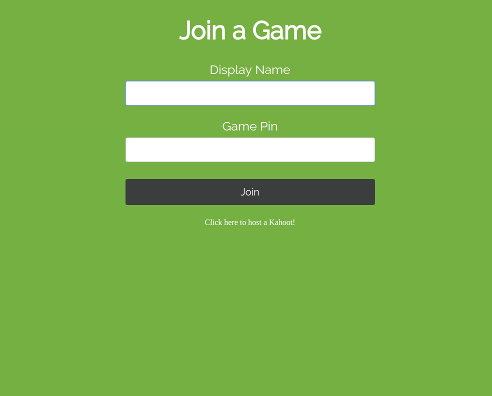
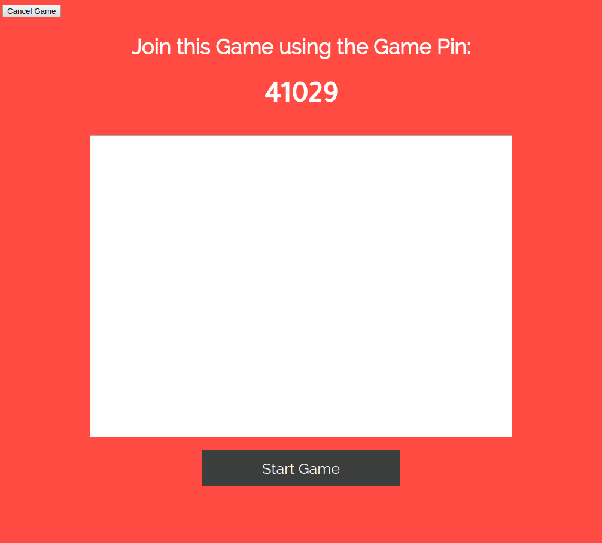

# kahoot-clone-nodejs

### Installing on OpenShift

1. Login to OpenShift by running `oc login`

1. Run `oc apply -f yaml/quiz-openshift.yaml`

To create a quiz, go to `http://HOSTNAME/create/`

If you wish to export your quiz, run: `scripts/mongo-export > quiz.json`

To import a quiz, run: `scripts/mongo-import quiz.json`

### Installing on non-OpenShift Kubernetes

Run: `kubectl apply -f yaml/quiz-k8s.yaml`

Note: The mongo deployment uses an image from Docker Hub. You may have to create a secret to get around Docker Hub's pull rate limit. After you create the secret, modify the mongo Deployment in `yaml/quiz-k8s.yaml` and point the `imagePullSecrets` field to your new secret.

### Installing on OpenShift using Source to Image

1. Login to OpenShift by running `oc login`

1. Run `scripts/deploy-on-openshift`

### Building on the local machine

1. Install MongoDB: `sudo apt-get install mongodb`

1. Start MongoDB: `sudo service mongodb start`

1. Make sure all node modules have been installed listed in `package.json`: `express`, `moment`, `mongodb`, `mongoose`, `socket.io`

### Description

This project is a kahoot clone that uses nodejs and mongodb

Multiple games can be ongoing at one time and works with many players per game

### Screen Shots

